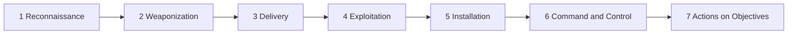

# Week 4 — Cyber Kill Chain Analysis of the Equifax Breach (2017)

**Course:** Introduction to Threat Hunting (ITH), Astana IT University, 2026–2027
**Group project topic:** Port Scanning / Reconnaissance Infrastructure
**Authors:** _<Full names of group members>_
**Date:** _<DD.MM.2026>_
**Repository:** _<GitHub link>_

---

## 1. Assignment and approach

**Week 4 tasks (syllabus, section 3.3):**
1. Analyze a real-world cyberattack using the stages of the Kill Chain.
2. Map each stage to the corresponding ATT&CK techniques (TTPs).

**Chosen attack:** the Equifax data breach of 2017. Our group topic is port scanning and reconnaissance, and this attack is a clear example of how an intrusion starts with finding a vulnerable, internet-facing system and how a single missed patch and a broken monitoring device can turn that into one of the largest data breaches in history.

**Main source:** U.S. House Committee on Oversight and Government Reform, *The Equifax Data Breach* (Majority Staff Report, December 2018), which is based on the Mandiant forensic investigation and interviews with Equifax officials. Where a statement is our own interpretation and not stated directly in the report, we say so.

**Kill Chain (Lockheed Martin, Hutchins et al., 2011)** describes an intrusion as 7 dependent stages. Breaking any one of them stops the attack.

## 2. Short summary of the incident

| Item | Fact (source: House Oversight report) |
|---|---|
| Victim | Equifax, one of the three largest US credit reporting agencies |
| Entry point | ACIS, an internet-facing consumer dispute portal built in the 1970s, running a vulnerable Apache Struts version |
| Vulnerability | CVE-2017-5638, remote code execution in Apache Struts, CVSS 10.0 |
| Attack duration | 76 days: 13 May – 30 July 2017 |
| Impact | About 148 million consumers (first announced as 143 million); names, SSNs, birth dates, addresses, driver's licence numbers; 209,000 credit card numbers and 182,000 dispute documents |
| Detection | 29 July 2017, after an expired certificate on a traffic-inspection device was renewed |

**Timeline**

| Date | Event |
|---|---|
| 7 Mar 2017 | Apache discloses CVE-2017-5638 and releases a patch. Exploit information appears the same day on FreeBuf and in Metasploit |
| 8 Mar | US-CERT alerts Equifax |
| 9 Mar | Equifax GTVM team emails about 430 people, ordering the patch within 48 hours. A scan the same day fails to find the vulnerable component |
| 10 Mar | First evidence of Struts exploitation on servers connected to the Equifax network |
| 15 Mar | Second vulnerability scan of 958 external IPs finds nothing |
| **13 May** | **Attackers enter through ACIS and drop web shells** |
| 13 May – 30 Jul | Credentials found, 48 databases accessed, about 9,000 queries, data exfiltrated |
| 29 Jul | Certificate renewed, suspicious traffic seen immediately |
| 30 Jul | ACIS taken offline, attack ends |
| 7 Sep | Public announcement |

---

## 3. Detailed Kill Chain analysis

### Stage 1 — Reconnaissance

**What happened.** The attackers needed to find systems running a vulnerable Apache Struts version. The report documents two pieces of reconnaissance-type activity:
- On **10 March 2017**, Mandiant found the first evidence of Struts exploitation on servers connected to the Equifax network. The attackers ran the `whoami` command and were trying to discover *other* potentially vulnerable servers. Mandiant labels this the "initial recon" step, but found **no direct evidence** that it was connected to the activity that started on 13 May.
- Equifax later found persistent attempts to contact the ACIS portal from a Chinese IP address **since 25 July 2017**.

Our interpretation: since the vulnerability was public and exploited worldwide within days, the attackers most likely found ACIS by scanning internet-facing systems for the vulnerable software. The report does not describe the scanning itself, so this part is inferred.

**Why it worked.** ACIS was reachable from the internet, and Equifax itself did not know where Struts was running: two internal scans (9 and 15 March) failed to find it. The first scan ran on the root directory, not on the sub-directory where Struts was installed. The second checked 958 external IPs and found nothing. Equifax "did not know what software was used within its legacy environments" (report, section V.C.3).

**ATT&CK mapping**

| Technique | Why |
|---|---|
| T1595.002 Active Scanning: Vulnerability Scanning | Searching for hosts running vulnerable Struts (inferred) |
| T1592.002 Gather Victim Host Information: Software | Identifying the framework and version behind the portal (inferred) |

**How the chain could have been broken.** Know your own attack surface. Equifax's scans were the defender's version of reconnaissance, and they failed. A working asset and software inventory would have shown that ACIS ran Struts.

---

### Stage 2 — Weaponization

**What happened.** No custom malware was needed. On **7 March 2017**, the day the vulnerability was disclosed, instructions for exploiting it were posted on the Chinese security site FreeBuf and in **Metasploit**, a free penetration-testing framework. Researchers saw exploitation attempts almost immediately, including simple commands like `whoami` and more advanced ones. The NVD rated the attack complexity as **low**, requiring **no privileges** and **no user interaction** (CVSS base score 10.0).

**What this tells us.** The "weapon" was free, public and easy. The attackers' real advantage was not skill in this stage but time: Equifax was exposed for 145 days (8 March – 30 July) after being warned.

**ATT&CK mapping**

| Technique | Why |
|---|---|
| T1588.005 Obtain Capabilities: Exploits | Using a publicly available exploit for CVE-2017-5638 |

**How the chain could have been broken.** Patching. Apache released the fix on the same day as the disclosure, and Equifax's own email of 9 March demanded the patch within 48 hours. The vulnerable component in ACIS was never updated. This single action would have removed the attack's foundation.

---

### Stage 3 — Delivery

**What happened.** Delivery was a network request straight to a public web application. There was no phishing email, no malicious attachment and no user involved. The vulnerability was in the way Apache Struts processed data sent to the server (the multipart file-upload parser, exploited through a malicious `Content-Type` header, as described in Cisco Talos's public analysis cited by the report). The attackers sent a crafted request to the ACIS portal over the internet.

**Important detail.** The ACIS environment had firewalls at the perimeter of the web servers, but the attackers exploited Struts on the **application servers** and bypassed them (Mandiant). A firewall that allows web traffic to the portal cannot tell that a particular request is malicious.

**ATT&CK mapping**

| Technique | Why |
|---|---|
| T1190 Exploit Public-Facing Application | Delivery through the internet-facing ACIS portal. In this attack, delivery and exploitation happen in the same request, so this technique covers both stages 3 and 4 |

**How the chain could have been broken.** Equifax had written a Snort intrusion-detection rule for Struts exploitation on 14 March and installed it. It did not help, because the traffic was encrypted and the device that decrypts it for the IDS had an expired certificate (see stage 6). A web application firewall rule, or making the vulnerable portal not directly reachable, would also have helped.

---

### Stage 4 — Exploitation

**What happened.** On **13 May 2017**, the attackers entered the Equifax network through the Struts vulnerability in ACIS. The unpatched parser executed attacker-controlled input, giving **remote command execution** on the application servers. From this moment the attacker could run commands directly on Equifax systems.

The first evidence of the same vulnerability being exploited was already on 10 March (`whoami`), so the flaw had been available to any attacker for two months before the confirmed intrusion began.

**Additional weaknesses found afterwards.** On 30 July, Equifax's own testing of ACIS found further flaws: **SQL injection** and **Insecure Direct Object Reference**. A malicious JSP file had been inserted into the application through SQL injection. So the application had more than one way in.

**ATT&CK mapping**

| Technique | Why |
|---|---|
| T1190 Exploit Public-Facing Application | The Struts vulnerability exploited on 13 May |
| T1059 Command and Scripting Interpreter | Commands executed on the server after code execution was gained |

**How the chain could have been broken.** Patch, and least-privilege for the web service, so that compromising the web application does not give access to the rest of the network.

---

### Stage 5 — Installation

**What happened.** Right after gaining execution, the attackers uploaded **web shells**: malicious scripts on the web server that give remote control (run commands, read and write files, manipulate databases). They created web shells on **both** application servers. About **30 unique web shells** were used during the attack. The ones Equifax later found were JSP files.

**Why this matters.** Web shells gave the attackers persistence. Even if the original vulnerability had been patched during the 76 days, they could still get back in.

**Why it was not noticed.** Mandiant stated that **file integrity monitoring** could have detected the creation of these files by alerting on unauthorized changes. Equifax did **not** have file integrity monitoring enabled on ACIS.

**ATT&CK mapping**

| Technique | Why |
|---|---|
| T1505.003 Server Software Component: Web Shell | About 30 web shells on the ACIS application servers |

**How the chain could have been broken.** File integrity monitoring on the web directories, and restricting write access to them.

---

### Stage 6 — Command and Control (C2)

**What happened.** The attackers controlled the servers through the web shells, sending commands over the same HTTP/HTTPS channel the portal normally used. They interacted with ACIS from about **35 different IP addresses**. When Equifax finally saw the activity, it involved an IP address originating in China and a second address owned by a German ISP but leased to a Chinese provider.

**The failure that hid all of it.** Equifax used an **SSL Visibility (SSLV) appliance** that decrypted traffic to and from ACIS so that the intrusion detection and prevention systems behind it could inspect it. The certificate on that device had **expired on 31 January 2016**. The report states that the default setting let traffic pass through **uninspected** when the certificate expired, so the IDS and IPS could not see any encrypted traffic. The result: **19 months** without visibility into ACIS traffic. (Note: the GAO reported ten months; the House committee's documents show the January 2016 expiry date, so we use 19 months.) Equifax had allowed more than 300 certificates to expire, including 79 for monitoring business-critical domains.

**ATT&CK mapping**

| Technique | Why |
|---|---|
| T1071.001 Application Layer Protocol: Web Protocols | Commands sent through web shells over HTTP/HTTPS |
| T1090 Proxy (probable) | About 35 IP addresses were used. The report does not explain how they were obtained, so this mapping is our assumption |

**How the chain could have been broken.** Monitoring of the monitoring: alerts on expired certificates and on the health of security devices, and configuring the device to block, not pass, traffic when it cannot inspect it. When Equifax uploaded 67 renewed certificates on **29 July 2017 at 9 pm**, it saw suspicious traffic almost immediately.

---

### Stage 7 — Actions on Objectives

The attackers' goal was data theft. This stage is long (about 76 days) and has several sub-steps, which Mandiant's own attack lifecycle also separates. The Kill Chain has no separate boxes for them, so we describe them inside stage 7.

**7a. Credential access.** After installing the web shells, the attackers found a **mounted file share containing unencrypted application credentials** (username and password) in a configuration file. Storing credentials this way went against Equifax's own policy. Equifax did not limit access to sensitive files across its legacy systems.

**7b. Lateral movement and internal reconnaissance.** ACIS needed access to only **three** databases, but it was not separated from the rest of the network. With the found credentials, the attackers reached **48 unrelated databases**. They first queried table **metadata** to learn what each table contained, then queried the interesting tables.

**7c. Collection.** The attackers ran about **9,000 queries**. **265** of them returned data containing personal information. None of that data was encrypted at rest. They saved the results of each of the 265 queries into files.

**7d. Staging and exfiltration.** The files were **compressed** and placed in a **web-accessible directory**, then transferred out of the network using the `Wget` utility and, in part, through the web shells. Because encrypted traffic was not inspected, nobody saw the data leave.

**Result.** Personal data of about 148 million consumers was stolen.

**ATT&CK mapping**

| Sub-step | Technique | Why |
|---|---|---|
| 7a | T1552.001 Unsecured Credentials: Credentials In Files | Plain-text credentials in a config file on a file share |
| 7b | T1078 Valid Accounts | Using the found credentials to access 48 databases |
| 7b, 7c | T1213 Data from Information Repositories | About 9,000 database queries, including metadata queries |
| 7d | T1074.001 Data Staged: Local Data Staging | Results saved to files and placed in a web directory |
| 7d | T1560 Archive Collected Data | Files compressed before transfer |
| 7d | T1041 Exfiltration Over C2 Channel | Part of the data was sent out through the web shells |

**How the chain could have been broken.** Network segmentation (ACIS should only reach its 3 databases), no plain-text credentials, encryption of sensitive data at rest, and monitoring of outbound traffic and database query volume.

---

## 4. Summary table

The detailed analysis is above. This table is only a summary for quick reference.

| Stage | Key fact | ATT&CK | Best place to break the chain |
|---|---|---|---|
| 1 Reconnaissance | Vulnerable Struts on ACIS found; Equifax's own scans missed it | T1595.002, T1592.002 | Asset and software inventory |
| 2 Weaponization | Public exploit on the day of disclosure | T1588.005 | Apply the patch |
| 3 Delivery | One request to a public portal | T1190 | WAF rule, working IDS |
| 4 Exploitation | Remote command execution on 13 May | T1190, T1059 | Patch, least privilege |
| 5 Installation | About 30 web shells | T1505.003 | File integrity monitoring |
| 6 C2 | 35 IPs; inspection blind for 19 months | T1071.001, T1090 | Certificate and device health monitoring |
| 7 Actions | 48 databases, 9,000 queries, 148M people | T1552.001, T1078, T1213, T1074.001, T1560, T1041 | Segmentation, encryption at rest, egress monitoring |

**Observation.** The Kill Chain has 7 stages, but describing the same attack in ATT&CK needed techniques from about eight different tactics (Reconnaissance, Resource Development, Initial Access, Execution, Persistence, Credential Access, Command and Control, Collection and Exfiltration). Most of the difference is in stage 7, which hides several ATT&CK tactics inside one box.

---

## 5. Application to our group topic (Port Scanning / Reconnaissance)

In Weeks 2–3 we performed reconnaissance ourselves against the permitted target `scanme.nmap.org`, and stored the results in MISP. In Kill Chain terms, **all of our work so far is Stage 1 (Reconnaissance)**, the same stage the Equifax attackers began with.

| Our activity | Kill Chain stage | ATT&CK technique |
|---|---|---|
| Nmap port scan (22/25/80/443) | 1 Reconnaissance | T1595.001 Scanning IP Blocks |
| Banner grabbing (OpenSSH 7.4, Apache 2.4.6) | 1 Reconnaissance | T1592.002 Gather Victim Host Information: Software |
| Shodan lookup | 1 Reconnaissance | T1596.005 Search Open Technical Databases: Scan Databases |
| Maltego DNS graph | 1 Reconnaissance | T1590.002 Gather Victim Network Information: DNS |

**Lesson from Equifax for our topic.** The same activities that we did as students are what an attacker does to find a target like ACIS, and what defenders must do to their own systems first. Equifax's scanning tools failed to find Struts on its own servers, while attackers found it. That is why the reconnaissance stage is where defense is cheapest.

**Update to our MISP event (Week 3).** To connect this week to the previous one, we added Kill Chain and ATT&CK context to Event 2, which also resolves the "Contextualisation" warning MISP showed:
- taxonomy tag `kill-chain:Reconnaissance`
- ATT&CK galaxy tags for T1595, T1592 and T1596
- tag `test-data` to separate our authorised coursework activity from real threat data

``

## 6. Conclusions

1. The Equifax attack followed all 7 stages, but it was not sophisticated: the exploit was public, the patch existed, and the entry point was a known flaw.
2. The attack succeeded because several defenses failed at the same time: unpatched software (stage 2), no file integrity monitoring (stage 5), an expired certificate that blinded the IDS (stage 6), and no segmentation, plain-text credentials and unencrypted data (stage 7). Any one of them working would probably have stopped or shortened the attack.
3. The most valuable place to break the chain is the earliest one. Knowing which systems and software you expose is exactly the reconnaissance skill studied in our project.

## 7. Sources

- U.S. House Committee on Oversight and Government Reform, *The Equifax Data Breach*, Majority Staff Report, 115th Congress, December 2018. https://oversight.house.gov/wp-content/uploads/2018/12/Equifax-Report.pdf
- Hutchins, Cloppert, Amin, *Intelligence-Driven Computer Network Defense Informed by Analysis of Adversary Campaigns and Intrusion Kill Chains*, Lockheed Martin, 2011.
- MITRE ATT&CK, https://attack.mitre.org (technique IDs and names)
- NVD, CVE-2017-5638.
- U.S. GAO, *Data Protection: Actions Taken by Equifax and Federal Agencies in Response to the 2017 Breach* (GAO-18-559).

> _AI-use note (fill in according to the instructor's permission under the course Generative AI policy)._
