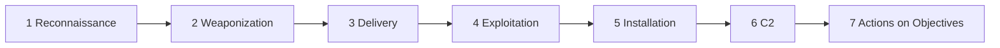

# Week 4 — The Cyber Kill Chain

**Course:** Introduction to Threat Hunting (ITH), Astana IT University, 2026–2027
**Group project topic:** Port Scanning / Reconnaissance Infrastructure
**Authors:** _<Full names of group members>_
**Date:** _<DD.MM.2026>_
**Repository:** _<link to GitHub repo>_

---

## 1. Week 4 tasks (Syllabus, section 3.3)

| # | Task from the syllabus | Where it is covered |
|---|---|---|
| 1 | Analyze a real-world cyberattack using the stages of the Kill Chain | Sections 3–4 |
| 2 | Map each stage to corresponding ATT&CK TTPs | Section 5 + Navigator layer |
| 3 | Recommended reading: Lockheed Martin, *Intelligence-Driven Defense* | Sections 2, 6 |
| 4 | Apply to our own group topic | Section 7 |

## 2. Theory: the Lockheed Martin Cyber Kill Chain

The Cyber Kill Chain was introduced by Hutchins, Cloppert and Amin (Lockheed Martin, 2011) in the paper *Intelligence-Driven Computer Network Defense Informed by Analysis of Adversary Campaigns and Intrusion Kill Chains*. Its central idea: an intrusion is a **sequence of dependent phases**. If a defender breaks the chain at any single phase, the whole attack fails, and the earlier the defender breaks it, the cheaper it is.

| # | Stage | What the attacker does |
|---|---|---|
| 1 | Reconnaissance | Selects and researches the target, scans for weaknesses |
| 2 | Weaponization | Couples an exploit with a payload |
| 3 | Delivery | Transmits the weapon to the target |
| 4 | Exploitation | Triggers the vulnerability, gains code execution |
| 5 | Installation | Installs a backdoor / persistence |
| 6 | Command & Control (C2) | Establishes a remote control channel |
| 7 | Actions on Objectives | Achieves the goal (data theft, destruction, etc.) |

For each stage the model defines six **Courses of Action** for defenders: **Detect, Deny, Disrupt, Degrade, Deceive, Destroy**.

### Kill Chain vs. MITRE ATT&CK

| Aspect | Kill Chain | ATT&CK |
|---|---|---|
| Granularity | 7 high-level phases | 14 tactics, 200+ techniques, sub-techniques |
| Purpose | Describes the *order* of an intrusion, guides where to break it | Describes *how* (concrete behaviours) an adversary does each thing |
| Linear? | Yes | No, tactics are not strictly sequential |
| Use in hunting | Prioritisation, coverage view | Hunt hypotheses, detection engineering |

They are complementary: the Kill Chain answers "**where** in the attack are we?", ATT&CK answers "**what exactly** is the adversary doing?".



## 3. Chosen real-world attack: Equifax breach (2017)

**Why this case.** Our project topic is *port scanning and reconnaissance*. The Equifax breach is a textbook example where **internet-wide scanning for a known vulnerable service** was the starting point, and where a failure in the *detection* capability let the attacker stay inside for months. The case is also very well documented in public sources (see section 9).

**Summary.**
- **Victim:** Equifax, US credit-reporting company.
- **Impact:** personal data of about 147 million people (names, SSNs, birth dates, addresses; in part driver's licence and card numbers).
- **Root vulnerability:** CVE-2017-5638, remote code execution in Apache Struts 2 (Jakarta Multipart parser), disclosed on 7 March 2017 with a patch available.
- **Attacker access window:** mid-May to late July 2017 (about 76 days); the breach was detected on 29 July 2017.
- **Attribution:** in February 2020 the US Department of Justice indicted four members of China's PLA 54th Research Institute.

## 4. Kill Chain analysis of the Equifax attack

| Stage | What happened in the Equifax case |
|---|---|
| **1. Reconnaissance** | Attackers scanned internet-facing systems looking for hosts running vulnerable Apache Struts versions. They found the public online dispute portal (ACIS) which ran an unpatched Struts version. They then probed the environment to understand it. |
| **2. Weaponization** | A public proof-of-concept exploit for CVE-2017-5638 was available within days of disclosure. The attackers used it as-is or with minor changes, with commands to run on the server as the payload. No custom malware was needed at this stage. |
| **3. Delivery** | The exploit was delivered as a single crafted HTTP request to the public portal, with a malicious OGNL expression placed in the `Content-Type` header. |
| **4. Exploitation** | The Struts parser evaluated the expression, giving remote command execution on the web server. |
| **5. Installation** | The attackers deployed web shells (dozens of them according to the US House Oversight report) to keep access even if one entry point was removed. |
| **6. Command & Control** | Commands were sent through the web shells over ordinary HTTPS, from many IP addresses in different countries. The traffic was encrypted, and Equifax's traffic-inspection tool could not decrypt it (see below). |
| **7. Actions on Objectives** | The attackers found credentials stored in plain text on internal file shares, moved laterally to other systems and databases, ran thousands of database queries, staged and compressed the results and exfiltrated them in small chunks to avoid volume alerts. |

**The key failure (defender side).** A network inspection device that should have decrypted and analyzed outbound traffic had an **expired SSL certificate for roughly 19 months**, so exfiltration went unseen. When the certificate was renewed on 29 July 2017, the suspicious traffic immediately became visible. This is a direct threat-hunting lesson: *a detection control that silently stops working is equivalent to having no control*.

## 5. Mapping to MITRE ATT&CK

| Kill Chain stage | ATT&CK tactic | Technique / sub-technique | Evidence in Equifax case |
|---|---|---|---|
| 1 Reconnaissance | Reconnaissance (TA0043) | **T1595.002** Active Scanning: Vulnerability Scanning | Scanning for vulnerable Struts hosts |
| 1 Reconnaissance | Reconnaissance | **T1592.002** Gather Victim Host Information: Software | Identifying the Struts version in use |
| 1 Reconnaissance | Reconnaissance | **T1590** Gather Victim Network Information | Mapping the exposed portal and environment |
| 2 Weaponization | Resource Development (TA0042) | **T1588.005** Obtain Capabilities: Exploits | Using the public CVE-2017-5638 exploit |
| 3–4 Delivery + Exploitation | Initial Access (TA0001) | **T1190** Exploit Public-Facing Application | Malicious Content-Type header to the ACIS portal |
| 4 Exploitation | Execution (TA0002) | **T1059.004** Command and Scripting Interpreter: Unix Shell | Commands executed on the server after RCE |
| 5 Installation | Persistence (TA0003) | **T1505.003** Server Software Component: Web Shell | Web shells planted on servers |
| 7 (internal) | Credential Access (TA0006) | **T1552.001** Unsecured Credentials: Credentials In Files | Plain-text credentials on file shares |
| 7 (internal) | Lateral Movement (TA0008) / Defense Evasion | **T1078** Valid Accounts | Using found credentials to reach other systems |
| 7 (internal) | Discovery (TA0007) | **T1083** File and Directory Discovery, **T1046** Network Service Discovery | Locating databases and data of interest |
| 6 C2 | Command and Control (TA0011) | **T1071.001** Application Layer Protocol: Web Protocols; **T1573** Encrypted Channel | Web-shell commands over HTTPS |
| 6 C2 | Command and Control | **T1090** Proxy | Many IP addresses in different countries |
| 7 Actions | Collection (TA0009) | **T1213** Data from Information Repositories | Thousands of database queries |
| 7 Actions | Collection | **T1560** Archive Collected Data; **T1074** Data Staged | Compression and staging before exfiltration |
| 7 Actions | Exfiltration (TA0010) | **T1041** Exfiltration Over C2 Channel; **T1030** Data Transfer Size Limits | Small chunks over the existing channel |

> Observation: the Kill Chain has 7 boxes, while ATT&CK needs about 8 different tactics to describe the same attack. In particular, **Credential Access, Lateral Movement and Discovery** happen *inside* stage 7 and have no dedicated box in the Kill Chain. This is the main reason hunters prefer ATT&CK for detailed work.

**Visualization:** the file `Week4_Equifax_ATTCK_Navigator_Layer.json` (in this repository) can be loaded into ATT&CK Navigator (Open Existing Layer → Upload from local). Insert the screenshot below.

``

## 6. Defender's view: Courses of Action per stage

| Stage | Detect | Deny / Disrupt | What would have broken the chain at Equifax |
|---|---|---|---|
| 1 Recon | Web/IDS logs for mass scanning patterns | Firewall rules, reduce exposed surface, asset inventory | Knowing that the ACIS portal was exposed and running Struts |
| 2 Weaponization | Threat intel feeds on new exploits | Patch management | Applying the March 2017 patch |
| 3 Delivery | WAF / IDS signature on malicious `Content-Type` | WAF blocking | WAF rule for CVE-2017-5638 |
| 4 Exploitation | Endpoint alerts on web server spawning shell | Patching, least privilege for web service | Patch and process-spawn detection |
| 5 Installation | File integrity monitoring on web directories | Remove web shells, restrict write access | FIM would have flagged new files |
| 6 C2 | TLS inspection, egress analysis | Egress filtering, proxying | **Valid certificate on the inspection device** |
| 7 Actions | DB activity monitoring, DLP, volume anomalies | Segmentation, credential vaulting | Not storing credentials in plain text, DB query monitoring |

**Lesson:** defense-in-depth. Any *one* of the controls above, working properly, would very likely have stopped the attack or shortened it dramatically.

## 7. Applying the Kill Chain to our group topic (Port Scanning / Reconnaissance)

In Weeks 2–3 we performed reconnaissance ourselves against the authorized target `scanme.nmap.org` and stored the results in MISP. Now we place our own activity into the framework.

### 7.1 Our Week 2–3 activities mapped to Kill Chain and ATT&CK

| Our activity (Week 2–3) | Kill Chain stage | ATT&CK technique |
|---|---|---|
| Nmap port scan (ports 22/25/80/443) | 1 Reconnaissance | T1595.001 Scanning IP Blocks / T1595.002 Vulnerability Scanning |
| Nmap banner grabbing (OpenSSH 7.4, Apache 2.4.6) | 1 Reconnaissance | T1592.002 Gather Victim Host Information: Software |
| Shodan lookup (IP 45.33.32.156) | 1 Reconnaissance | T1596.005 Search Open Technical Databases: Scan Databases |
| Maltego DNS/MX graph | 1 Reconnaissance | T1590.002 Gather Victim Network Information: DNS |
| VirusTotal reputation check | 1 Reconnaissance (target/infra research) | T1596 Search Open Technical Databases |

**Key insight for our topic:** all our activity sits in **Stage 1 (Reconnaissance)**. This is exactly the stage that the Equifax attackers began with, and it is also the stage where the defender has the **earliest and cheapest** chance to break the chain.

### 7.2 Connection to MISP (Week 3)

MISP flagged our event with a "Contextualisation" warning because it had no tags. We close this gap now by adding the following to Event 2:

- Taxonomy tag: `kill-chain:Reconnaissance`
- ATT&CK galaxy tags: `misp-galaxy:mitre-attack-pattern="Active Scanning - T1595"`, `"Gather Victim Host Information - T1592"`, `"Search Open Technical Databases - T1596"`
- Tag `test-data` to separate our authorized coursework activity from real threat activity (as described in our Week 3 filtering step)

``

### 7.3 Threat hunting hypotheses (looking ahead to Week 5)

1. **Hypothesis:** an external host is scanning our public IP space. *Data:* firewall/IDS logs. *Hunt:* one source IP touching many ports or many hosts in a short time window (T1595).
2. **Hypothesis:** someone is exploiting a known public-facing application vulnerability. *Data:* web server / WAF logs. *Hunt:* requests whose headers contain expression syntax such as `%{` or `${` (T1190). Illustrative Sigma-style logic:

```yaml
title: Suspicious expression syntax in Content-Type header (Struts-style, illustrative)
status: experimental
logsource:
    category: webserver
detection:
    selection:
        cs-content-type|contains:
            - '%{'
            - '${'
    condition: selection
level: high
tags:
    - attack.initial_access
    - attack.t1190
```

3. **Hypothesis:** a detection control has silently failed. *Hunt:* verify certificates and health of inspection tools and log sources (the exact Equifax failure). Alert on "no logs received from source X for N hours".

## 8. Conclusions

1. The Kill Chain is a good **strategic** model for understanding where an attack is and where to break it; ATT&CK adds the **tactical detail** needed for hunting and detection engineering.
2. In the Equifax attack, reconnaissance (scanning) and exploitation of a known, patchable vulnerability opened the door, and a broken detection control allowed months of undetected access.
3. Our project topic (port scanning / reconnaissance) corresponds to Stage 1, where detection and asset visibility are cheapest and most effective.
4. Our MISP event from Week 3 is now enriched with Kill Chain and ATT&CK context, which makes it usable for the hunting work in Weeks 5–7.

## 9. Sources

- Hutchins, Cloppert, Amin. *Intelligence-Driven Computer Network Defense Informed by Analysis of Adversary Campaigns and Intrusion Kill Chains*. Lockheed Martin, 2011.
- MITRE ATT&CK: https://attack.mitre.org
- US House Committee on Oversight and Government Reform. *The Equifax Data Breach* (majority staff report), December 2018.
- US GAO. *Data Protection: Actions Taken by Equifax and Federal Agencies in Response to the 2017 Breach* (GAO-18-559), 2018.
- US Department of Justice press release on the indictment of four PLA members, 10 February 2020.
- NVD entry for CVE-2017-5638.
- MISP Project documentation (taxonomies and galaxies): https://www.misp-project.org

> **Note on AI use:** _<Add here, if permitted by the instructor: which parts were prepared with AI assistance and verified by the group, per the course Generative AI policy.>_

## 10. Repository checklist

- [ ] `Week4_Cyber_Kill_Chain.md` (this report)
- [ ] `images/navigator_equifax.png`
- [ ] `images/misp_event_tags.png`
- [ ] `Week4_Equifax_ATTCK_Navigator_Layer.json`
- [ ] Commits made during the week with meaningful messages
