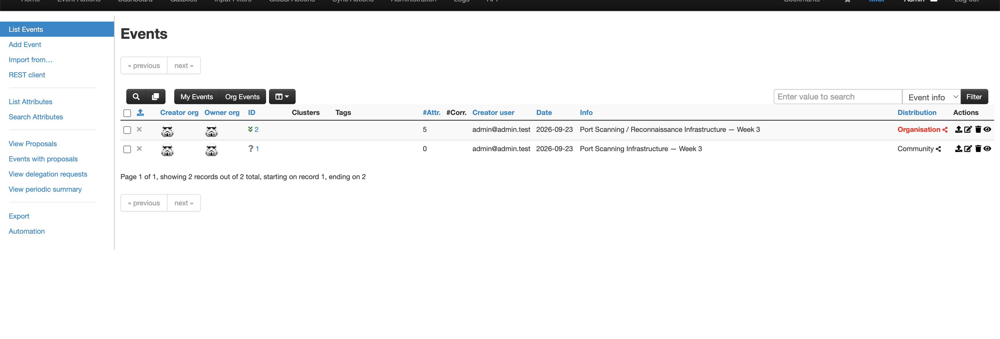
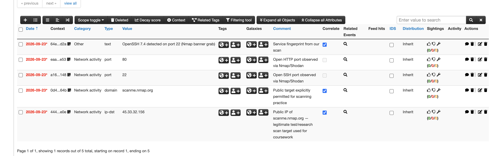
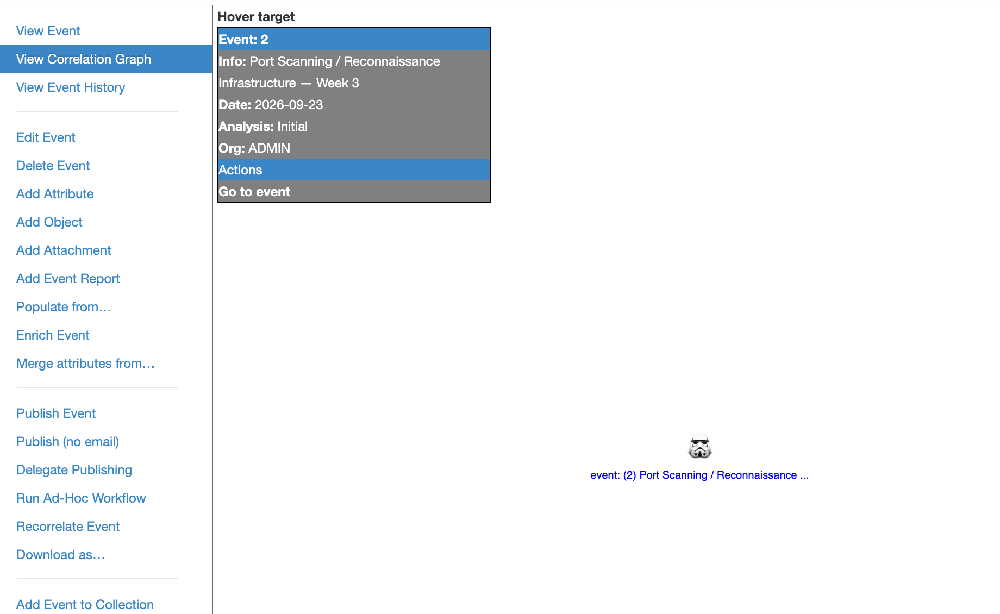

# Week 3 — Data Processing and Exploitation
### Applied to: Port Scanning and Reconnaissance

**Group:** CS-2427
**Date:** 23.09
**Team members:** Tursynbek

---

## 1. Goal for this week

Take the raw indicators collected in Week 2 (IPs, domains, reputation
data around scanning/reconnaissance activity) and turn them into
**structured, normalized, searchable intelligence** using MISP
(Malware Information Sharing Platform), so it can be correlated against
our own logs in later weeks.

---

## 2. Deploying MISP

We deployed MISP locally using the official Docker-based install for
speed and reproducibility.

```bash
git clone https://github.com/MISP/misp-docker.git
cd misp-docker
cp template.env .env
# edit .env: set BASE_URL, admin email/passphrase
docker compose up -d
```

- Accessed the web UI at `https://localhost` (or the configured host)
- Logged in with the default admin account and changed the password


*(If your team used a hosted/demo MISP instance instead, replace this
section with how you accessed it and note that it is a shared/demo
environment.)*

---

## 3. Creating an event and importing IOCs

We created a new MISP **Event** to hold all indicators related to our
topic:

- **Event title:** `Port Scanning / Reconnaissance Infrastructure — Week 3`
- **Threat level:** Low/Medium (context: mostly research/scanning-grade activity, not confirmed intrusion)
- **Distribution:** Your organisation only (for the exercise)

**Attributes imported**, sourced from our Week 2 collection:

| Type | Value (example — replace with real data) | Source |
|---|---|---|
| ip-dst | `45.x.x.x` | Shodan lookup, Week 2 |
| domain | `example-scanner.net` | Maltego pivot, Week 2 |
| md5 / sha256 | (if any file was involved, e.g., a scanning tool sample) | VirusTotal, Week 2 |
| comment | "Repeated SYN scans observed against ports 22, 80, 443" | Our own analysis |



---

## 4. Filtering and normalization

Raw data collected across three different tools (Shodan, VirusTotal,
Maltego) did not share a common format. We normalized it as follows:

| Problem | How we fixed it |
|---|---|
| Different timestamp formats (Shodan ISO 8601 vs. VirusTotal Unix epoch) | Converted all timestamps to UTC ISO 8601 before import |
| IP ranges written inconsistently (CIDR vs. dash-range) | Standardized to CIDR notation |
| Duplicate indicators seen in more than one tool | De-duplicated before creating MISP attributes; noted which sources corroborated each other |
| Irrelevant/benign entries (e.g., our own scanning of scanme.nmap.org) | Filtered out — tagged as `test-data`, excluded from the "real" IOC set |

We also tagged each attribute using MISP's taxonomy, e.g.:
- `tlp:amber` or `tlp:green` (traffic-light protocol, depending on sensitivity)
- a custom tag `recon:port-scan` to make it easy to filter later

---

## 5. Applying MISP's correlation feature

MISP automatically correlates attributes that appear in more than one
event/feed. We reviewed:

- Whether our imported IPs correlated with any built-in/community feed
  already in MISP (e.g., known scanner list feeds such as GreyNoise-style
  data, if configured)


---

## 6. Exporting for future use

We exported the event as both:
- **MISP JSON format** (`misp_event_export.json`) — for re-import or
  scripted processing
- **STIX 2.1** (if the instance supports it) — for interoperability with
  other tools

These exports will feed into the Cyber Kill Chain mapping (Week 4) and
later hunting hypotheses.

---

## 7. Data quality issues we encountered

Per the course's "data quality problems" framework:

- **Missing telemetry:** we don't yet have our own network logs to
  confirm whether these scanning IPs actually touched our systems —
  this is a gap to close in later weeks (internal telemetry).
- **False positives risk:** some flagged IPs are legitimate research
  scanners (Shodan/Censys crawler ranges), not malicious actors —
  documented and tagged separately rather than treated as confirmed threats.
- **Duplicate/recycled OSINT:** some VirusTotal community comments simply
  repeated the same original blog post — we counted this as one source,
  not independent corroboration.

---

## 8. Sources consulted

- MISP Training Documentation: https://www.misp-project.org/training/
- MISP official documentation: https://www.misp-project.org/documentation/
